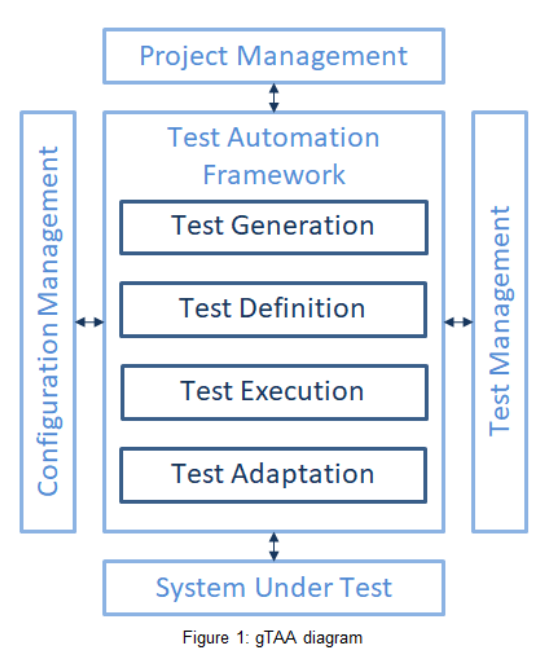
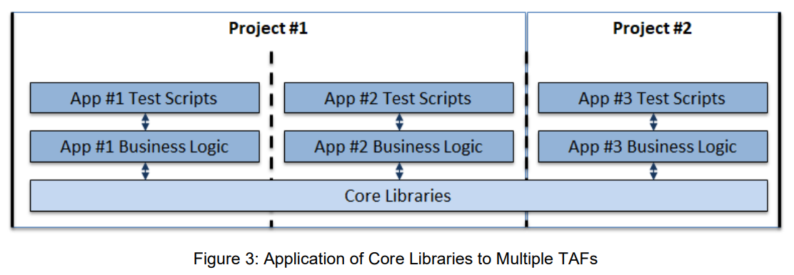

# Chapter 3: Test Automation Architecture

---

## 3.1 Design Concepts Leveraged in Test Automation

### 3.1.1 Major Capabilities in a Test Automation Architecture

#### **Generic Test Automation Architecture (gTAA) Overview**

- **gTAA** provides a high-level design for how test automation interacts with:
  - The SUT (System Under Test)
  - Project management tools
  - Test management tools
  - Configuration management/CI-CD

#### **gTAA Interfaces**

  
*Figure 1: gTAA diagram*

- **SUT Interface:** Connects TAF to the SUT (e.g., APIs, UI drivers).
- **Project Management Interface:** Tracks test automation status/progress.
- **Test Management Interface:** Maps test case definitions to automated scripts.
- **Configuration Management Interface:** Manages environments and testware (e.g., Docker, GitHub Actions, Jira/Xray).

#### **Capabilities Provided by Test Automation Tools**
- **Test Generation:** Automated creation of tests from models (e.g., Model-Based Testing).
- **Test Definition:** Defining and implementing test cases/suites, with separate test data.
- **Test Execution:** Running tests, logging, and reporting results (e.g., Cypress, Playwright).
- **Test Adaptation:** Adapting tests to different SUT interfaces (adapters for APIs, UI protocols, etc.).

**Career Examples:**
- Used Postman collection generation (test generation), Jira Xray for test definition, Playwright for execution, and custom scripts for adapting to API vs. UI.

---

### 3.1.2 How to Design a Test Automation Solution

**Steps:**
- Understand functional/non-functional/technical requirements.
- Select tools (commercial/open-source).
- Develop plugins/components as needed.
- Define interfaces: firewalls, DBs, URLs, mocks/stubs, message queues.
- Integrate with test management (Jira/Xray) and version control (Git/GitHub).
- *Example:* Migrated to Playwright for better browser automation, integrated with GitHub Actions and Jira.

---

### 3.1.3 Layering of Test Automation Frameworks

**Layered Structure and Scaling Example:**

  
*Figure 3: Application of Core Libraries to Multiple TAFs*

- **Test Scripts:** Store test cases, call business logic.
- **Business Logic:** SUT-specific actions, inherits from core, configures TAF.
- **Core Libraries:** Reusable tools/utilities for any project.

Multiple projects can use the same core libraries, each having their own TAF and business logic.

---

### 3.1.4 Approaches for Automating Test Cases

| Approach             | Pros                                      | Cons                                      | Example from Your Career      |
|----------------------|-------------------------------------------|-------------------------------------------|-------------------------------|
| Capture/Playback     | Easy setup, no code needed                | Not scalable, hard to maintain            | Selenium IDE, Katalon recording|
| Linear Scripting     | Easy to start, modifiable                 | Not scalable, SUT must be available       | Basic Cypress scripts         |
| Structured Scripting | Scalable, maintainable, reusable          | Needs programming skills, setup time      | Cypress/Playwright frameworks |
| Test-Driven Dev (TDD)| Improves quality, code structure, coverage| Hard for new teams, discipline required   | Defined API tests before coding|
| Data-Driven Testing  | Expands tests with data, easy to scale    | Needs good test data management           | Postman/Cypress with CSV data |
| Keyword-Driven       | Non-coders can write cases, reusable      | High setup/maintenance for keywords       | Robot Framework, custom KDT   |
| BDD                  | Natural language, improves comms          | Needs discipline, hard to debug           | Cucumber, Playwright+Gherkin  |

---

### 3.1.5 Design Principles and Patterns

#### **OOP Principles**
- Encapsulation, Abstraction, Inheritance, Polymorphism

#### **SOLID Principles**
- SRP, OCP, LSP, ISP, DIP

#### **Design Patterns for TAEs**
- **Facade:** Hides complexity, exposes only what’s needed.
  - *Career Example:* Used in Cypress/Playwright helper classes for common actions.
- **Singleton:** Ensures one instance (e.g., browser/web driver).
- **Page Object Model:** One class per page—update locators in one place.
  - *Career Example:* Playwright Page Object Models for each React page.
- **Flow Model:** Abstraction over Page Objects—stores user flows, reusable steps.
  - *Career Example:* Cypress custom commands for login, navigation, etc.

#### **Visual: Page Object + Flow Model**

```
+----------------------+
|     Test Script      |
+----------+-----------+
           |
+----------v-----------+
|   Flow Model Layer   |  <--- User flows (login, checkout, etc.)
+----------+-----------+
           |
+----------v-----------+
|  Page Object Layer   |  <--- One class per UI page
+----------+-----------+
           |
+----------v-----------+
| Web Driver/Adapter   |
+----------------------+
```

---

## **Summary Table: Chapter 3 Topics & Career Examples**

| Topic            | Key Points & Visuals                                   | Career Example               |
|------------------|-------------------------------------------------------|------------------------------|
| gTAA             | High-level interfaces, see Figure 1                    | Postman/Cypress+Jira+GitHub  |
| TAA/TAS Design   | Tool selection, plugin/components, integration         | Playwright+GitHub Actions    |
| TAF Layering     | Scripts → Biz Logic → Core Libs (see Figure 3)         | Cypress/Playwright structure |
| Test Approaches  | Table of pros/cons, career mapping                     | Used DDT/BDD/structured      |
| Design Patterns  | Facade, Singleton, Page Object, Flow Model (diagram)   | Playwright/Cypress POM/flows |

---
**Visuals are integrated for you to associate real diagrams with each concept. Refer to Figures 1 and 3 above when memorizing layered and architectural concepts.**